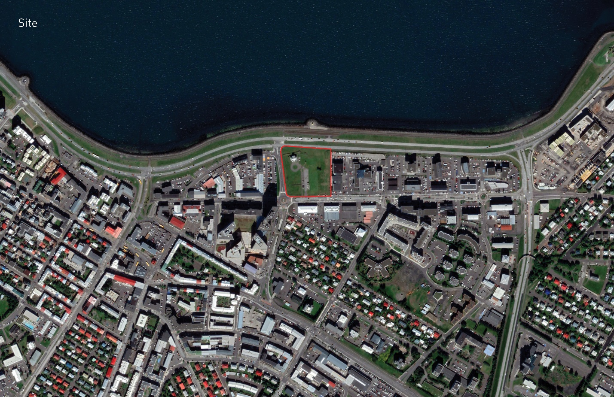
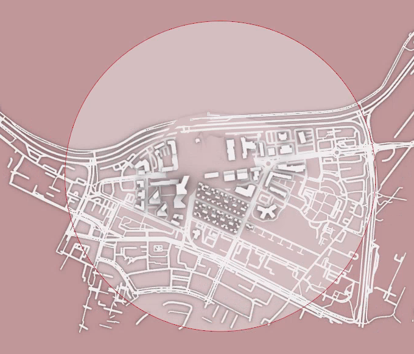
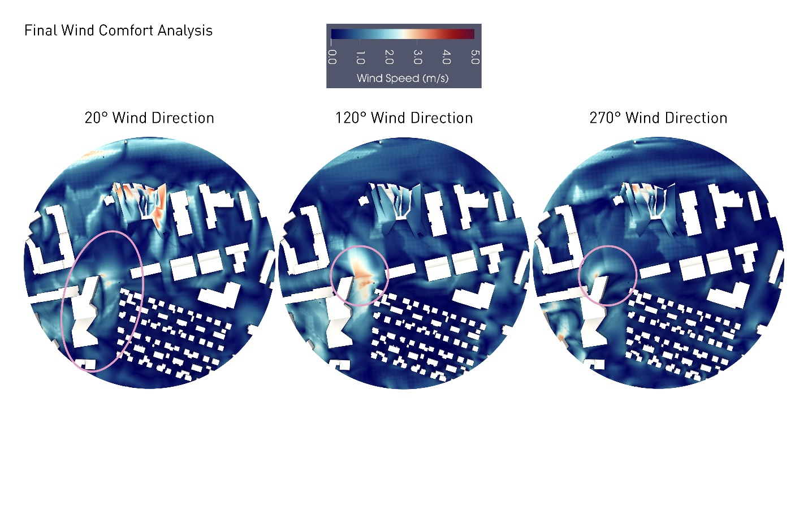
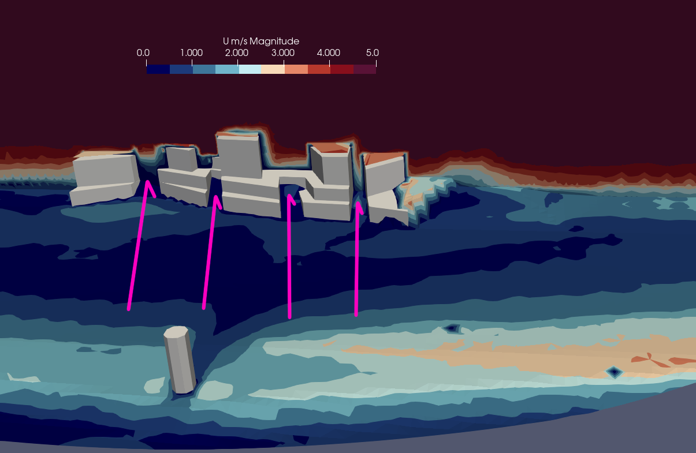

**Case Study**

**Location : Reykjavik, Iceland / Site of Hofdi House**

**Building Program : UN Commissioned Climate Research Center**

**Background**

This case study looks at the impacts of a 155,000 square foot building
placed on the site of the Hofdi House in Reykjavik Iceland. The site is
approximately 430' x 430' situated along the N shore of the city of
Reykjavik with a slope of approximately 15' from the S to the N
(shoreline). The site, as it sits now is empty sans the Hofdi House
which sits in the NW corner of the site. The house is approximate 30 x
40 feet and 2-3 stories tall.

To the SW of the site there is a \~275' tall "skyscraper" which is the
among the tallest buildings in Iceland and has caused much controversy
because of its height and impacts on the wind along these streets in
Iceland.

{width="6.5in" height="4.205555555555556in"}The
buildings on the W/E/S side of the site are all commercial and between
3-5 stories above grade.

In considering the design for the building on the site great thought was
put into existing comfort and wind conditions and how a new building
would affect those conditions.

An existing conditions simulation was done with Eddy3d, with just the
site and surrounding buildings, as well as the Hofdi House, without any
intervention to see the conditions present. 24 Wind Directions were
simulated, and 3 were picked out as the "worst" conditions:

{width="6.5in"
height="4.205555555555556in"}

A UTCI analysis was done as well for the extremes : the coldest avg day
in winter, the avg spring day, and the warmest summer day. Weather data
was taken from the Reykjavik Airport which sits 2 mi SW of the site in
an EPW file from <http://climate.onebuilding.org/> with data for the
last 20 yrs.

The script used is available as an Eddy Template, and then slightly
modified. We will walk through it here:

24 Wind Directions were chosen, and fed into the Uniform Flow Boundary
Condition component, along with the EPW file as stated. The UF BC was
chosen given that there is terrain. Later in the final simulation, The
Geometry of the building was created into one single mesh, with no
windows or details -- just the final massing. It is very important that
the mesh is closed, and as simple as you can make it without sacrificing
too much that is important for the simulation. Remember, at the
resolution that this simulation is done, it does not matter if
windows/mullions/small indentations/details are present. For this first
simulation there was no building, just the site (see below). The
Simulation Domain was set up to be 1000m outside radius, and 500m
height, about 6x the height of the tallest object in the domain (the
skyscraper on the SW corner of the site). For this simulation I did
2,500 iterations.

{width="6.5in" height="5.563194444444444in"}

The results of the simulation as shown above were filtered and 3 were
picked out as the "worst" case scenarios:

{width="6.5in"
height="4.205555555555556in"}

You can see that in a northerly to notheasterly wind a large wind tunnel
is created along the streets running in the similar direction. You can
see that the street w/ the tallest building on the corner is much worse
than the street a little to the east, and you can see a signature of a
vortex forming where even in a N wind, you also get a nasty wind tunnel
in the E-W direction along the other main road. Note that this does not
happen in the E Street, as that building is quite low (3 floors).

In the 120° direction you can note that the only major issue is again
around the skyscraper, with another large vortex from the wind hitting
the E corner and creating a vortex.

You can see that our open site allows for some dissolving of this affect
in all wind directions. If a tall building were to be built there, or
one too close to the street, it could have the potential to create a
worse wind tunnel effect along the entire road from E-W south of the
site.

The challenge was to create a building that would not exasperate this,
but also not completely take away the open site which functions as a
park, from the city, nor the view of the mountains from the site (quite
beautiful)

**Program**

The assigned program of the project is a UN Commissioned Climate
Research Center. The building had to engage the public, house the
private researchers, be home to a world class research center and have a
positive impact on the city of Reykjavik.

{width="6.5in"
height="4.205555555555556in"}

You can see here the layout of the program, with private and research
facilities located on one side, and slowly becoming more public to the
right of the building with a central core and vertical circulation. The
facility houses several labs (wet and dry), auditoriums, cafeteria
spaces, storage spaces, computer labs, offices, administration, and
more.

As stated before, the form of the build was derived from 3 ideas :
minimizing impact to the existing conditions, giving the park back to
the people, and keeping with local Icelandic architecture of low
buildings, emulating glaciers and crevices. The crevices would be used
for energy generation later in the process with the N wind.

The process for form is detailed below:

{width="6.5in"
height="4.205555555555556in"}{width="6.5in"
height="4.205555555555556in"}

With the completion of the form finding a final outdoor wind study was
done w/ the massing in place; using the same settings as before for the
simulation.

{width="6.5in" height="4.205555555555556in"}

Above you can see for the same wind directions; the vortex from the tall
building at the SW corner of the site is still very much present,
however, the addition of our building has not made that condition worse.
Looking at it in more detail, it is thought that it helped a little bit
by blocking some of the upsloping wind from the water making its way S
across our site, if anything. You can notice that in a north wind we
have a decent wind signature along the crevices of our building. This
funneling can be used in the crevices to generate electricity as well.

{width="6.5in" height="4.2340277777777775in"}

You can see in this cross section for the 0° wind direction (Wind coming
in the direction of the arrows) how the speed is maximized in the
crevices.

Pressure variable shows this nicely as well:\
{width="6.5in"
height="4.2340277777777775in"}

In the other cross section for the same wind direction you can see how
the wind is pushed upwards at the front of the building by the façade
where it is not allowed in the crevices, and then pushed down the slope
of the building's green roof:

{width="6.5in"
height="4.279861111111111in"}

You can see that the wind speed decreases at the lowest level closest to
the ground as the air is forced higher since the N side of the build is
at an elevation as tall as the building on the S side of the Site. This
creates a "bubble" of lower wind velocities at ground level on the S
side of the site.

**Conclusion**

By doing this Eddy simulation early in the process, I was able to
identify key issues with the site and its surroundings with respect to
wind, pressure, and outdoor comfort. Given Iceland's climate and the
influence from the Atlantic, it is not overly cold, and not overly warm.
With good material choice and construction, a building could be made to
be habitable and comfortable and net positive. A big emphasis was put on
the wind condition, as I knew the outdoor comfort was not the \# 1
issue. I would not have identified this however without Eddy. Doing
subsequent simulations during the form finding (at a low resolution, and
low iter count for ease and quickness) helped refine the idea and come
to the final simulation and form.

The files are attached here for you to look and see how a simulation
like this is done.
